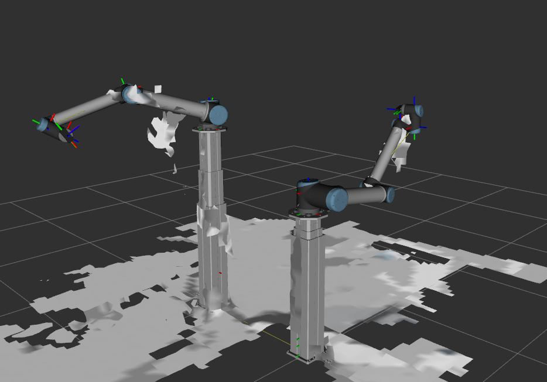

# Setup

```
sudo apt update
sudo apt install python3-rosdep
sudo rosdep init
rosdep update
```

# Cuda

https://nvidia-isaac-ros.github.io/getting_started/index.html
https://nvlabs.github.io/curobo/latest/getting-started/installation.html
https://nvidia-isaac.github.io/nvblox/v0.0.10/index.html
https://nvidia-isaac-ros.github.io/repositories_and_packages/isaac_ros_nvblox/isaac_ros_nvblox/index.html#quickstart

CUDA 13

```bash
sudo apt install nvidia-driver-580
sudo reboot

# Προσθήκη του NVIDIA CUDA repository
wget https://developer.download.nvidia.com/compute/cuda/repos/ubuntu2404/x86_64/cuda-keyring_1.1-1_all.deb
sudo dpkg -i cuda-keyring_1.1-1_all.deb
sudo apt update
sudo apt install nvidia-cuda-toolkit

sudo apt update
sudo apt install ros-jazzy-actuator-msgs
sudo apt update
sudo apt install ros-jazzy-ros-gz-sim
sudo apt install ros-jazzy-ros-gz-bridge
sudo apt-get install libcanberra-gtk-module libcanberra-gtk3-module
sudo apt install ros-jazzy-moveit ros-jazzy-geometric-shapes

```

```bash
gz fuel download -u "https://fuel.gazebosim.org/1.0/OpenRobotics/models/office desk"
gz fuel download -u "https://fuel.gazebosim.org/1.0/OpenRobotics/models/bed"
gz fuel download -u "https://fuel.gazebosim.org/1.0/OpenRobotics/models/office chair"
```

# Build

```
make
```

# Usefull reference

/opt/ros/jazzy/share/nvblox/nvblox_examples_bringup/

# Usefull commands

pkill -f ros2

ros2 launch moveit_setup_assistant setup_assistant.launch.py
ros2 launch workcell_bringup workcell.launch.py
ros2 launch workcell_bringup workcell.launch.py sim_gazebo:=true use_fake_hardware:=false
ros2 launch workcell_bringup workcell.launch.py sim_gazebo:=false use_fake_hardware:=false

ros2 run tf2_tools view_frames

# Trubleshooting

add this in .bashrc

```
export UV_SKIP_WHEEL_FILENAME_CHECK=1
```

sudo apt install ros-jazzy-orbbec-description

```bash
export ISAAC_ROS_WS=/home/kaipis/Desktop/projects/robotics/ros2_cuda_robotic_ws
NGC_ORG="nvidia"
NGC_TEAM="isaac"
PACKAGE_NAME="isaac_ros_nvblox"
NGC_RESOURCE="isaac_ros_nvblox_assets"
NGC_FILENAME="quickstart.tar.gz"
MAJOR_VERSION=4
MINOR_VERSION=4
VERSION_REQ_URL="https://catalog.ngc.nvidia.com/api/resources/versions?orgName=$NGC_ORG&teamName=$NGC_TEAM&name=$NGC_RESOURCE&isPublic=true&pageNumber=0&pageSize=100&sortOrder=CREATED_DATE_DESC"
AVAILABLE_VERSIONS=$(curl -s \
    -H "Accept: application/json" "$VERSION_REQ_URL")
LATEST_VERSION_ID=$(echo $AVAILABLE_VERSIONS | jq -r "
    .recipeVersions[]
    | .versionId as \$v
    | \$v | select(test(\"^\\\\d+\\\\.\\\\d+\\\\.\\\\d+$\"))
    | split(\".\") | {major: .[0]|tonumber, minor: .[1]|tonumber, patch: .[2]|tonumber}
    | select(.major == $MAJOR_VERSION and .minor <= $MINOR_VERSION)
    | \$v
    " | sort -V | tail -n 1
)
if [ -z "$LATEST_VERSION_ID" ]; then
    echo "No corresponding version found for Isaac ROS $MAJOR_VERSION.$MINOR_VERSION"
    echo "Found versions:"
    echo $AVAILABLE_VERSIONS | jq -r '.recipeVersions[].versionId'
else
    mkdir -p ${ISAAC_ROS_WS}/isaac_ros_assets && \
    FILE_REQ_URL="https://api.ngc.nvidia.com/v2/resources/$NGC_ORG/$NGC_TEAM/$NGC_RESOURCE/\
versions/$LATEST_VERSION_ID/files/$NGC_FILENAME" && \
    curl -LO --request GET "${FILE_REQ_URL}" && \
    tar -xf ${NGC_FILENAME} -C ${ISAAC_ROS_WS}/isaac_ros_assets && \
    rm ${NGC_FILENAME}
fi

sudo apt update &&
sudo apt-get install -y ros-jazzy-isaac-ros-nvblox

```

# Docker development

sudo apt update
sudo apt install docker-buildx

create an nvidia account and [login -> account -> api key](https://org.ngc.nvidia.com/account/api-keys)

docker login nvcr.io
Username: Γράψτε ακριβώς τη λέξη $oauthtoken (συμπεριλαμβανομένου του δολαρίου).Password: Κάντε επικόλληση το API Key που αντίγραψατε από το site της NVIDIA.

launch the container

run_dev.sh

the usaac ros common should be on 3.2-15 release
